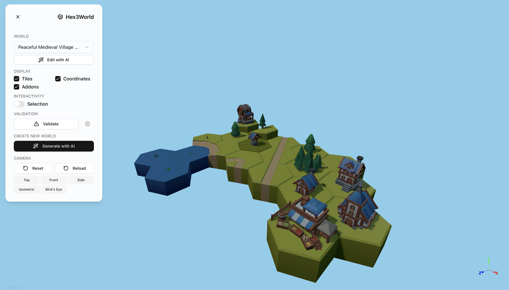

# 🌍 Hex3World

> AI-powered 3D hex world generator built with Next.js




Generate beautiful 3D hex-based worlds using natural language descriptions. Just tell the AI what kind of world you want, and watch it build it tile by tile with real-time validation.

## ✨ Features

- 🤖 **AI World Generation** - Describe your world in natural language
- 🔧 **Multiple LLM Providers** - OpenAI, Claude, or local models
- 🎨 **3D Visualization** - Interactive rendering with Three.js
- 📦 **Asset Pack System** - Modular tile sets and add-ons
- ✅ **Smart Validation** - Real-time tile compatibility checking

## 🎨 Assets

This project comes with beautiful medieval-themed 3D assets from the [KayKit Medieval Hexagon Pack](https://kaylousberg.itch.io/kaykit-medieval-hexagon). The pack includes:

- **200+ Low-poly 3D models** - Optimized for performance across all platforms
- **Hexagonal tiles** - Roads, rivers, coasts, and terrain variations
- **Medieval buildings** - Castles, houses, blacksmiths, taverns, mills, and more
- **Color variants** - Buildings available in blue, red, green, and yellow
- **Nature props** - Trees, rocks, hills, mountains, and atmospheric elements
- **CC0 Licensed** - Free for personal and commercial use

All assets are textured with a single gradient atlas (1024x1024) and compatible with major 3D engines.

### Using Custom Assets

While this project ships with the KayKit Medieval pack, it's designed to work with any 3D asset collection. To use your own assets, you'll create:

- **Asset pack JSON** - Defines available tiles, buildings, and props with their 3D model paths and metadata (for now, a manual process)
- **World JSON files** - Pre-built worlds that reference your custom assets (which you'll be able to generate using AI)

The JSON schemas define tile types, placement rules, edge compatibility, and 3D model references. See the `public/assets/packs/` and `public/assets/worlds/` directories for examples of the required format.

## 🚀 Quick Start

```bash
# Install dependencies
npm install

# Set up environment
cp env.example .env.local
# Edit .env.local with your API key

# Run the app
npm run dev
```

Open [http://localhost:3000](http://localhost:3000) and start generating worlds!

### Example Prompts
- "A peaceful village by a lake with roads"
- "A medieval castle town with stone structures"
- "Rolling hills with scattered trees and streams"

## 🔧 Configuration

Add your LLM provider API key to `.env.local`:

```bash
# OpenAI
LLM_PROVIDER=openai
OPENAI_API_KEY=sk-your-key-here

# Or Claude
LLM_PROVIDER=claude
CLAUDE_API_KEY=sk-ant-your-key-here

# Or Local (Ollama, LM Studio, etc.)
LLM_PROVIDER=local
LOCAL_LLM_BASE_URL=http://localhost:1234
```

## 🎨 How It Works

The AI uses a tool-calling system to build worlds:
1. **Planning** - Analyzes your description and available tiles
2. **Placement** - Places tiles one by one with real-time validation
3. **Validation** - Ensures all tile connections are compatible
4. **Iteration** - Adjusts and refines based on feedback

## 🚀 Deployment

For production deployment, see [DEPLOYMENT.md](./docs/DEPLOYMENT.md) for security configurations and best practices.

## 📚 Learn More

- Detailed architecture: [PLAN.md](./docs/PLAN.md)
- Schema documentation: [SCHEMA_DRAFTS.md](./docs/SCHEMA_DRAFTS.md)
- Security guide: [SECURITY.md](./docs/SECURITY.md)